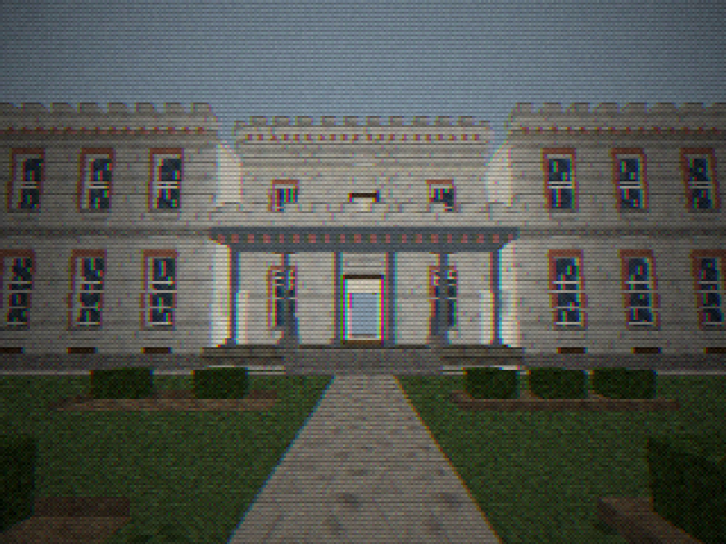
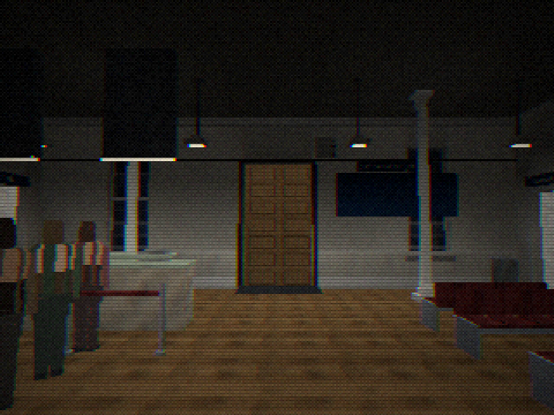

# COUNTY LINE

A first-person horror game. This repository is at **Stage 3: Richmond
Central** — the building of Stage 2 leased to a bus company, wired to a
breaker panel, and given a night's work to do. There is a game in it
now: one complete, replayable overnight shift, eight to one, with
tickets to sell, bags to check, coaches to load and paperwork to
close out.

There is still nothing frightening in it, and that is deliberate.
County Line should be fun before it becomes scary, and this is the
stage that has to be fun.

County Line is a spiritual follow-up to
[FINAL RENTAL](https://github.com/EMSoftwareInnovators/Final-Rental), and
inherits the proven parts of its technology: the software rasterizer, the
PS1-era look, the runtime-generated textures and audio, the gamepad
handling, the desktop shell. It is a separate game in a separate
repository and shares no content, no save data and no branding with it.

---

## Running it

You need [Node](https://nodejs.org) 18 or newer. Nothing else — the game
has no runtime dependencies and downloads nothing.

```sh
git clone https://github.com/EMSoftwareInnovators/County-Line.git
cd County-Line
npm install          # only for the test harnesses and the desktop build
npm start            # then open http://localhost:8080
```

`npm install` is not needed to play it. If you only want to run the game:

```sh
npm start
```

Browsers refuse to load ES modules from `file://`, so it has to be served
over `http://`. `serve.cjs` is forty lines of dependency-free Node whose
only job is to hand the files over with the right content type.

### As a desktop application

```sh
npm run app          # runs it in Electron from the repository
npm run dist:mac     # builds a .app for macOS (arm64 and x64)
```

The desktop build serves the game to itself over its own `game://` scheme
rather than running a socket inside a shipped game.

---

## What is in it

### The Old Academy of Richmond County

540 Telfair Street, Augusta, Georgia — built 1801–02, remodeled in
1856–57 into the crenellated Tudor-Gothic building that stands today, and
the home of the Augusta Museum of History from 1937 to 1995. Pressing NEW
TEST GAME puts you on the front walk looking at it.

It is reconstructed at approximately real-world scale from a 1994 measured
plan, the museum's own visitor maps and photographs of the building:
112'9" across, 94'0" deep, two floors, 36 rooms, 37 doors, both historic
staircases, a one-story columned portico under a crenellated terrace with
the central block standing above it, and the open-air garden court between
the two rear wings with **no floor and no bridge over it at any point**.

Inside, the first floor is very tall — the central room is about 15'9"
clear — with multi-pane sash windows running from a low sill almost to
the ceiling, painted beadboard wainscot, tall historic doors and the
slender white structural columns the photographs show down the middle of
the big room.



**[docs/OLD-ACADEMY.md](docs/OLD-ACADEMY.md)** documents the sources, the
two places the reconstruction knowingly departs from a printed figure and
why, what is measured and what is estimated from photographs, the
coordinate origin, the full room and door schedule, and the module
layout. `docs/academy/` holds 24 views of it, and `docs/academy/review/`
the same 24 with the CRT switched off for comparison against the
reference photographs.

### Richmond Central Coach Terminal

Georgia Coach Lines took a fifteen-year lease on the empty Academy in
the spring of 1998 and opened a terminal in it in the August. **The bus
company adapted to the Old Academy; the Old Academy did not adapt to
the bus company** — which is a rule about the source as much as about
the fiction. Nothing under `src/world/levels/academy/terminal/` cuts a
wall, a door, a window, a floor or a ceiling. It is furniture,
equipment, signage and paint, and deleting the directory gives the 1856
building back.



One night: five hours of terminal time in forty real minutes, five
coaches, fifteen passenger archetypes, a fare card built on road
mileages, a cash drawer counted in at eight and reconciled at one,
checked baggage on numbered claim checks, manifests signed at the bay,
a public address that can only say things the building knows, twelve
ordinary things that go wrong, and thirteen electrical circuits on
three panels in the room the museum called the Docent Library.

**[docs/RICHMOND-CENTRAL.md](docs/RICHMOND-CENTRAL.md)** documents the
premise, what went in which room and what forced it, the shape of a
shift, the five moves of a transaction, the electrical schedule, and
where every part of it is in the source. `docs/terminal/` holds twenty
views of it.

### The greybox testbed

Stage 1's disposable test rig is still here, as `testbed`, because it is
what the engine harness runs against — known coordinates, deliberately
plain:

| Space | What it is there to test |
|---|---|
| Hall | a 14.7 × 13.6 m room with a **9 m ceiling** — long sightlines and a double-height volume |
| Staircase | 20 risers at 7½ in on an 11 in tread, hall to first floor |
| Gallery | a first floor open to the hall over a railed edge |
| Upper room | a small room off the gallery, behind a door |
| Corridor | 2.65 m wide and 13.6 m long — narrow, for scraping along walls |
| Workroom | an ordinary-height room with the windows and props |
| Yard | outside, through the front door, down a 150 mm step |

It contains one set of double doors, two interior single doors, one
exterior door, seven windows, one generic interactable, one light switch
and one NPC test actor. **It is disposable** and none of it should be
kept; it survives only so that `tools/play.mjs` has somewhere with known
coordinates to test movement, stairs, doors and interaction.

### Controls

| | |
|---|---|
| **W A S D** | walk |
| **mouse** | look |
| **Shift** | hurry |
| **Ctrl** | crouch |
| **E** | use whatever you are looking at |
| **Esc** | pause |
| **F1** | cycle the developer read-out — off, one line, everything, **architecture mode** |
| **F2** | draw the collision world |
| **F3** | jump to the top of the stairs |
| **F4** | architecture-review mode — the CRT off, for comparing against photographs |

**SETTINGS is a menu of short pages, not one long list:** Audio, Looking,
Picture, Controls, and a *Reset all settings* that puts every value back
to its default while leaving the key and controller bindings alone.
Internal resolution, the retro filter and vertex snapping are under
**Picture**, which is also on the pause menu in its own right, one
keypress from paused. Mouse and pad sensitivity, **Invert look (Y)** and
field of view are under **Looking**. No page is more than six rows.

Moving the mouse or the trackpad *away* from you looks up. If it does the
opposite, Invert look is on — which is easy to do by accident, since any
row is one keypress from being toggled while you are hunting for another
one. *Looking* is where to turn it off and *Reset all settings* is the
way back if more than one thing has been nudged.

Architecture mode is the fourth F1 position and reads out in feet and
inches: where you are relative to the level origin, the current room's
bounds and how much clear space is around you, the nearest doorway with
its size and state, and the plan figures to check them against.

**F1 to F4 are development-only.** A shipped build has none of them: the
production marker is checked once at start-up and the keys are never
bound. Architecture-review mode is not a graphics option and the player
never sees it — it changes how a finished frame is presented, not what
was drawn, which is the only way a comparison against a photograph means
anything.

Everything above can be rebound, on the keyboard and on a controller,
from SETTINGS → **Controls**. Xbox and PlayStation pads are both understood,
and a pad the browser will not describe can be laid out by hand.

---

## Scale

**One world unit is one meter.** Real architectural measurements are in
feet and inches; convert them where they are written down, with the
helpers in `src/engine/units.js`, so the source reads as the drawing does
and the engine only ever sees meters.

```js
import { ft, ftin, inch } from './engine/units.js';
const WALL = ft(24);        // a 24-foot wall
const CEIL = ftin(14, 6);   // a 14 ft 6 in ceiling
const RISE = inch(7.5);     // a 7½ inch riser
```

Axes: **+X east, +Y up, +Z north**, so a floor plan drawn with north up
reads straight onto them. Yaw 0 faces +Z and increases toward +X.

Storeys are numbered the American way: `room.floor` is **1** for the floor
you walk in on, **2** for the one above it, and **0** for grade — the
grounds, or a courtyard below the entrance level. Every level uses that
numbering, so "upstairs" means the same thing in all of them.

The numbers everything else is tuned against, all in `SCALE`:

| | |
|---|---|
| Player height | 1.778 m (5 ft 10 in) |
| Eye height | 1.661 m (5 ft 5½ in) |
| Crouched eye | 1.016 m |
| Collision radius | 0.279 m (11 in) |
| Walk / hurry / crouch | 1.72 / 3.05 / 0.95 m/s |
| Step-up height | 0.178 m (7 in) |
| Door leaf | 2.032 × 0.914 m (6 ft 8 in × 3 ft) |
| Stair rise / run | 0.191 / 0.279 m (7½ in / 11 in) |

The step-up height is deliberately just under a stair riser, so a
staircase is always climbed by its ramp collider and never by the
step-up rule.

---

## Source layout

```
src/
  engine/          knows nothing about County Line
    units.js       the scale convention, and feet -> meters
    mathx.js       3x4 affine matrices, angles, seeded RNG
    raster.js      the software rasterizer
    mesh.js        mesh construction and automatic subdivision
    texture.js     runtime texture generation
    postfx.js      the CRT: dither, bleed, scanlines, vignette
    collision.js   solids, floors, ramps, ceilings; the only mover
    input.js       keyboard, mouse, gamepad -> actions
    audio.js       the mixer, the synthesizer, positional sound
    storage.js     versioned, namespaced, corruption-tolerant records

  game/            knows it is a game, not which one
    game.js        the loop and the state machine, and nothing else
    player.js      the first-person controller
    collision-driven movement, interaction, doors, NPCs, campaign, save

  world/           how a building is described
    level.js       Level and LevelBuilder
    prefabs.js     walls with openings, stairs, railings, glazing
    lighting.js    baked vertex light
    materials.js   the developer greybox materials
    levels/        one module per level
      testbed.js   the disposable greybox test rig
      academy/     the Old Academy, in eleven modules
        dimensions.js   THE single source of truth: every plan dimension
        parts.js        parapet, drip mold, chair rail, colonnade, steps
        shell.js        the exterior envelope, elevation by elevation
        firstfloor.js   ground storey: slabs, rooms, partitions, doors
        secondfloor.js  upper storey, laid around the two stairwells
        stairs.js       the two switchback staircases
        porches.js      front porch, the gallery over it, rear porch
        roof.js         deck, parapet, chimneys
        grounds.js      the garden, the site, the walks, the stoops
        nav.js          the navigation graph
        index.js        assembly, lighting, spawn, marks

  ui/              the front end, as DOM over the framebuffer
```

---

## Checks

```sh
npm test             # everything: lint, units, renderer, build, browsers
npm run lint         # house style, storage hygiene, module size, compat
npm run build        # the production build, into dist/web
npm run check:app    # the Electron build (needs a display; use xvfb-run)
```

`npm test` includes `tools/academy.mjs`, which checks the Old Academy's
architectural invariants — the footprint, that nothing is ever built over
the garden or the rear porch, that the upper wings never bridge, that both
staircases exist away from the center line — and then **walks routes A to
K** with real key events, reporting which room it actually ended up in.
`tools/academy-doors.mjs` exercises every doorway in the building — leaf
alignment, collision when shut, passage when open, both approach sides,
and the eight canonical connections opened, walked and shut again.
`tools/unit.mjs` checks the dimensional arithmetic without a browser, so a
station that stops closing fails in milliseconds.

For Stage 3 there are three more. `tools/terminal.mjs` asks whether the
fit-out left the building walkable — clearance either side of all
thirty-eight openings, standing room at every station, and whether the
interaction ray actually reaches each one — and then exercises the
panel, the load model and the yard. `tools/shift.mjs` **plays the whole
night in about fifteen seconds**, through the stations' own handlers,
then saves it, goes back to the title, continues, and carries on.
`tools/clerk.mjs` does the same job with the keyboard: real interaction
ray, real use key, one whole transaction and one coach sent.

`npm run build` produces `dist/web`, which is what gets uploaded. A built
page is marked as production and **withholds the developer hooks** — no
`window.__game`, no module namespace, nothing to reach into a level with
from the console. The development server and an unpackaged `npm run app`
keep them, which is how every harness here still works. A packaged desktop
build is marked the same way.

`npm test` runs the browser suite once **per installed engine**, and
reports an engine it cannot find as SKIPPED rather than quietly not
running it. Chromium and Gecko disagree about pointer-lock deltas, about
what `requestPointerLock()` returns and about when an `AudioContext` may
start, so working in one is not evidence of working in the other.

To add Firefox:

```sh
npx playwright install firefox
# or, to use one already installed:
COUNTY_LINE_FIREFOX="/Applications/Firefox.app/Contents/MacOS/firefox" npm test
```

---

## What Stage 3 is not

No story and no campaign nights. **No Route 117**: no anomalous
tickets, no strange passengers, no supernatural manifests, no
impossible calls, no altered clocks, no ghosts and no scares. The
building settles every couple of minutes because a
hundred-and-ninety-six-year-old building with the heat off does, and it
is given no trigger, no cue and no reaction so that it stays nothing.

No final voice acting: an announcement is a line of text and a chime.
No final character art: six wardrobes on one rig, so that fifteen
people in a lobby are not the same person fifteen times.

The historic plan has been kept where it is inconvenient: the staircases
have not been moved, the awkward rooms have not been merged, no real door
has been closed and no fake one invented, the garden has not been
enclosed, and the footprint has not been simplified into a rectangle.

&copy; 2026 EM Software Innovators
