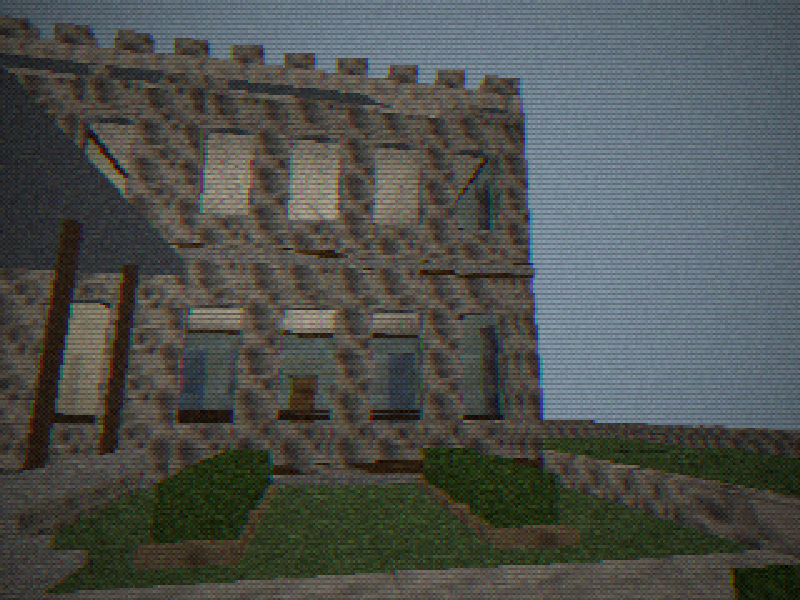

# The Old Academy of Richmond County

540 Telfair Street, Augusta, Georgia. Built 1801–02 as the Academy of
Richmond County, remodeled by Charles Blaney Cluskey and the builder
Goodrich in 1856–57 into the crenellated Tudor-Gothic building that
stands today, and the home of the Augusta Museum of History from 1937
until 1995.

Stage 2 of County Line reconstructs **the architecture of that building
and nothing else**: the fabric, the rooms, the circulation, the
staircases and the garden court, at approximately real-world scale. There
is no game in it. What Stage 2 is deliberately *not* is listed at the
bottom of this page.


---

## Sources, and how they were reconciled

| | |
|---|---|
| **1. The measured plan** | "The Augusta Museum / Augusta HEC / AlexanderDESIGN Inc. 8/1/94 / Richmond County/Augusta Plan 1.0.1", a first-floor plan at 1/16" = 1'-0", printed with both dimension strings and computed areas. **This is the dimensional authority.** |
| **2. The museum visitor maps** | First and second floor. Room identity and partition topology only — they are schematic, not to scale, and drawn for a visitor looking for the restroom. |
| **3. The Stage 2 door schedule** | The explicit six-direction connectivity the brief specifies for the central room, which overrides the visitor maps wherever they are silent. |

The measured plan disagrees with itself, because the dimension strings
are rounded to the inch and the printed areas are not:

| printed string | printed area | the area implies |
|---|---|---|
| 31' × 37'6" | 1166.306 ft² | 31'0" × 37'7½" |
| 31' × 37'6" | 1173.163 ft² | 31'0" × 37'10" |
| 44'6" × 32' | 1445.249 ft² | 44'6" × 32'6" |
| 30'6" × 26'6" | 818.276 ft² | 30'6" × 26'10" |

**Where they conflict the area is believed**: it came out of the drafting
software, the string came out of a rounding. Two consequences follow, and
they are the only two places this reconstruction knowingly departs from a
printed figure. Both are recorded in `src/world/levels/academy/dimensions.js`
beside the constants they produce.

### A. The exterior wall is 19½ inches

Not printed anywhere. It is the thickness that makes a 34'3" wing come
out at exactly the 31'0" interior the plan prints **three times**. That is
not a coincidence, and it is the keystone that makes everything else
close. With it, both wings close on 94'0" to the inch:

```
19½"  +  37'10"  +  12"  +  13'0"  +  12"  +  37'11"  +  19½"   =   94'0"
 ext    front block  cross  middle   cross  north band    ext
```

### B. The garden is 44'3" wide, not the printed 44'7"

112'9" less two 34'3" wings leaves 44'3". The brief's own priority order
puts the overall footprint and the wing proportions above an individual
annotation, so the four inches come out of the garden.

This produces a result worth stating plainly: **the garden is exactly as
wide as the central room.** The rear wings are the northward continuation
of the front block's flanking masses, and the plan's 44'7" and 44'6" are
one dimension measured twice. Both are `BAY`.

### What is measured, and what is assumed

Assumptions are marked in the source at the point of use. The
substantive ones:

| | |
|---|---|
| **Storey height** — *assumed* | No reference gives one. 14'6" clear on the first floor sits mid-range for an 1850s institutional building of this size. 18" of floor structure over it puts the second floor at exactly 16'0", which is 24 risers of exactly 8 inches. **The staircase governs the storey height, not the other way round** — the number was chosen to make the flight come out whole. |
| **Second-floor partitions** — *assumed from the visitor map* | The 1994 measured plan is first-floor only. The upper storey's partitions come from the museum's second-floor visitor map, which is schematic; the *rooms* are certain, their exact dimensions are not. |
| **Window rhythm** — *assumed from photographs* | Bay positions are spaced to match elevation photographs, not measured. Sill and head heights are chosen once and applied consistently. |
| **Roof form** — *simplified* | A flat deck behind the parapet. The parapet silhouette is the recognisable thing; what is behind it is not visible from the ground and is not reconstructed. |
| **Grade** — *assumed* | The site stands about 3 feet above the street. The front steps are sized from that. |

Nothing here is traced from a photograph, and no reference image is used
as a texture. Every material in `src/world/materials.js` is generated at
runtime from code.

---

## Coordinates

Stage 1's convention, unchanged. **1 world unit = 1 meter**, +X east,
+Y up, +Z north, yaw 0 faces north. A floor plan drawn with north up
reads straight onto the axes.

> **The origin (0, 0, 0) is the center of the first-floor central room, at
> finished floor level** — the room the visitor map calls REVOLUTIONARY
> WAR. X = 0 is therefore the building's center line, and the Telfair
> Street façade lies at Z = −31'4½".

Every dimension in the building is named once, in
`src/world/levels/academy/dimensions.js`, and **no other academy module
contains a plan dimension**. If a number is needed somewhere it is named
there first. The arithmetic is checked without a browser by
`tools/unit.mjs`, so a station that stops closing fails in milliseconds.

| station | ft | station | ft |
|---|---|---|---|
| `X_W_OUT` west face | −56'4½" | `Z_FACADE` | −31'4½" |
| `X_WING_W_IN` garden face, west wing | −23'9" | `Z_CENTRAL_S` / `_N` | ∓16'3" |
| `X_BAY_W` / `X_BAY_E` | ∓22'1½" | `Z_PORCH_N` garden begins | +32'10½" |
| `X_E_OUT` east face | +56'4½" | `Z_N_OUT` north end | +62'7½" |
| overall width | 112'9" | overall depth | 94'0" |
| each wing | 34'3" | central bay | 44'3" |
| first-floor ceiling | 14'6" | second floor at | 16'0" |

---

## The shape of it

```
                          N
        ┌──────────────┐     ┌──────────────┐
        │              │     │              │      the two rear wings,
        │  west wing   │  G  │  east wing   │      34'3" each, with the
        │              │  A  │              │      garden between them
        │   stair ▓    │  R  │    ▓ stair   │      open to the sky
        ├──────────────┤  D  ├──────────────┤
        │              │  E  │              │
        │              │  N  │              │
        ├──────────────┴─────┴──────────────┤
        │          rear porch (open)        │
        ├───────┬───────────────────┬───────┤
        │ west  │   CENTRAL ROOM    │ east  │      44'3" × 32'6"
        │ front │   (origin here)   │ front │      six doorways
        │ block ├───────────────────┤ block │
        │       │  front porch      │       │      recessed loggia,
        └───────┴───────────────────┴───────┘      cast-iron colonnade
                          S
```

The plan is a **U opening north**. The central front block is recessed
behind a two-tier cast-iron loggia between two projecting crenellated
masses; the two rear wings run 94 feet back from the façade with an
open-air garden court between them, covered at its south end by the rear
porch. **There is no floor over the garden and no bridge between the
upper wings at any point.** Standing in the garden and looking up you see
sky, and that is the single most characteristic thing about the building.

There is **no grand central staircase and never was one**: the center is
a room, not a hall. Both staircases are out in the wings' middle bands
against the outer walls, where both floor plans put them, and each is a
switchback of two 12-riser flights around a half-landing at the outer
end.



---

## What is in it

35 rooms, 40 doors, 63 render chunks, 57 navigation nodes on 77 edges,
about 12,000 triangles, 532 collision solids, 41 floors, 9 ramps.

### First floor

| room id | name | source |
|---|---|---|
| `academy.central` | Central Room | measured plan + brief |
| `academy.west.docent` | Docent Library | visitor map |
| `academy.west.store` | West Store Room | visitor map |
| `academy.indians` | Indians of the Southeast | visitor map |
| `academy.west.stairhall` | West Stair Hall | both plans |
| `academy.west.rearhall` | West Rear Hall | measured plan (the 226.9 ft² space) |
| `academy.west.restroom` | Restroom | visitor map |
| `academy.west.offices` | Offices | visitor map |
| `academy.americana.main` | Americana | visitor map |
| `academy.giftshop` | Gift Shop | visitor map |
| `academy.americana.inner` | Inner Americana | visitor map |
| `academy.east.rearhall` | East Rear Hall / USS Augusta | visitor map |
| `academy.east.stairhall` | East Stair Hall | both plans |
| `academy.east.animal` | Animal Room | visitor map |
| `academy.east.staff` | Staff | visitor map |
| `academy.east.service` | East Service Room | visitor map |
| `academy.east.vestibule` | East Vestibule | visitor map |
| `academy.east.council` | Council Room | visitor map |

### Second floor

| room id | name |
|---|---|
| `academy.upper.west.rotating` | Rotating Exhibits |
| `academy.upper.west.landing` | West Upper Landing |
| `academy.upper.west.history` | Augusta-Richmond County History |
| `academy.upper.center.war` | The War Room |
| `academy.upper.center.mammals` | Modern Mammals |
| `academy.upper.east.natural` | Natural History |
| `academy.upper.east.landing` | East Upper Landing |
| `academy.upper.east.minerals` | Rocks & Minerals |
| `academy.upper.east.archives` | Archives |

The War Room and Modern Mammals are **one meeting room with a spine wall
down it**, pierced by an 8-foot opening on the room's center line — which
is how the visitor map draws it and annotates it. The opening is at Z = 0,
not up at the landing doors, so crossing the upper floor west to east is a
dog-leg. **That is the building's, and it stays.**

### Outdoors

`academy.porch.front`, `academy.gallery` (the upper tier of the same
loggia), `academy.porch.rear`, `academy.garden`, and four ground volumes.
All four porch and garden rooms are flagged `outdoor: true`.

---

## The door schedule

The central room opens **six ways**, which is the schedule the brief makes
authoritative:

| door | to | |
|---|---|---|
| `central-front` | front porch | double, 6' × 9' |
| `central-rear` | rear porch | double, 6' × 9' |
| `central-indians` | Indians of the Southeast | south-west |
| `central-americana` | inner Americana | south-east |
| `central-westhall` | west rear hall | north-west |
| `central-easthall` | east rear hall | north-east |

and each rear hall has its own door onto the covered porch —
`west-hall-porch` and `east-hall-porch`, both at Z = +20'. Those eight
close both required loops: the long one out through Indians and back
through Americana, and the short one straight across the rear porch.

Three historic side entrances are modeled, each on its own stoop:
`west-side` (the visitor map's "Entrance to Railroad", facing the railroad
cut), `east-side-vestibule`, and `east-side-stair`.

---

## How the modules are laid out

```
src/world/levels/academy/
  dimensions.js   THE SINGLE SOURCE OF TRUTH. Every plan dimension.
  parts.js        the pieces this building needs and a generic prefab
                  library has no business knowing about: a crenellated
                  parapet, a drip mold, a string course, a chair rail,
                  a cast-iron colonnade, a flight of exterior steps
  shell.js        the exterior envelope, elevation by elevation
  firstfloor.js   the ground storey: slabs, rooms, partitions, doors
  secondfloor.js  the upper storey, laid around the two stairwells
  stairs.js       the two switchbacks
  porches.js      front porch, the gallery over it, the rear porch
  roof.js         deck, parapet, chimneys
  grounds.js      the garden, the site, the walks, the stoops
  nav.js          the navigation graph
  index.js        assembly, lighting models, spawn, marks
```

Chunking is per room and per envelope segment, so the frustum culler has
something smaller than a 94-foot wall to reject: `ext.west.north`,
`floor2.east.mid`, `academy.indians` and so on, 63 in all.

Room ids are stable and namespaced `academy.*`. They are what the save
format, the navigation graph and every test refer to, and they are meant
to survive Stage 3.

---

## Checking it

```sh
npm test                      # everything, including the academy
node tools/unit.mjs           # the dimensional arithmetic, no browser
PORT=8090 node serve.cjs &
node tools/academy.mjs        # the invariants and routes A–K, walked
node tools/academy-shots.mjs  # 24 views into docs/academy/
```

`tools/academy.mjs` drives the player with real key events and reports
which room it actually ended up in. It checks:

* the footprint is still 112'9" × 94'0" with 34'3" wings and a 44'3" bay;
* **no floor and no geometry chunk is laid over the garden or the rear
  porch**, and no upper room bridges between the wings;
* every room the brief names exists, and the porches and garden are
  outdoors;
* all eight required doorways exist and both central sets are real doubles;
* there are four stair flights, two per wing, none of them near the center
  line, each climbing a full half storey, with no room built inside a
  flight's footprint;
* and then walks routes **A to K**.

**F1 in the running game cycles into architecture mode**, which reads out
in feet and inches: where you are relative to the origin, the current
room's bounds and clear dimensions, the nearest doorway with its size and
state, and the plan figures to check them against.

---

## What Stage 2 is not

No bus terminal, ticket counters, coach bays, baggage or passengers. No
buses, and no Bus 117. No job, no shift gameplay, no story, no campaign
nights. No ghosts, no paranormal events, no scares. No final lighting and
no final decorative props — the building is lit to be *read*, not to be
atmospheric, and the garden carries turf, a gravel walk and a few shrubs
rather than period planting, because a courtyard full of planting only
makes it harder to judge whether the architecture is right.

The historic plan has been kept where it is inconvenient. The staircases
have not been moved, the awkward rooms have not been merged, no door has
been closed and none invented, the garden has not been enclosed, and the
footprint has not been simplified into a rectangle.
